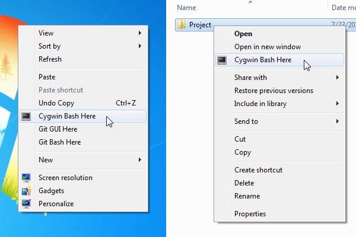

# Cygwin-Bash-Here
A tweak to open Cygwin Bash shell from Windows Explorer context menu.




## Installation

Just run `Install Cygwin-Bash-Here.reg` file.

The script assumes that Cygwin is installed to `C:/cygwin` or `C:/cygwin64`.


## How to use?

1. Right click on the Desktop, or any folder, or a folder background.
2. Choose `Cygwin Bash Here` (or press `b` instead).


## Why not to use `chere`?

Yes, there is another way to achieve the similar result: install `chere` package and run `chere -i -t mintty`

But there are [2 problems](https://github.com/mirror/chere/issues/2):

1. `chere`'s command doesn't work with paths having non-ASCII characters like `C:/Проект/dist`.
The home directory (`~`) is being open instead.

2. `chere`'s command doesn't open the currently *selected* folder ([Not opened. Selected](https://user-images.githubusercontent.com/3730074/28498658-134535f2-6fb3-11e7-95d2-dd68180dc507.png)).


## How does it work?

It adds a simple command to `HKCR\Directory\shell` and `HKCR\Directory\Background\shell`:

```
"C:\cygwin\bin\mintty.exe" --dir "%V" -e /bin/env CHERE_INVOKING=1 /bin/bash --login
```

The command starts the `mitty` terminal with the `--dir` option mentioned in the [mintty docs](https://github.com/mintty/mintty/wiki/Tips#starting-in-a-particular-directory), then it sets `CHERE_INVOKING` environment variable and runs `bash`.

`CHERE_INVOKING` is needed to prevent Bash change the working dir to user's home (see `cygwin64/etc/profile`).

### Good luck!
